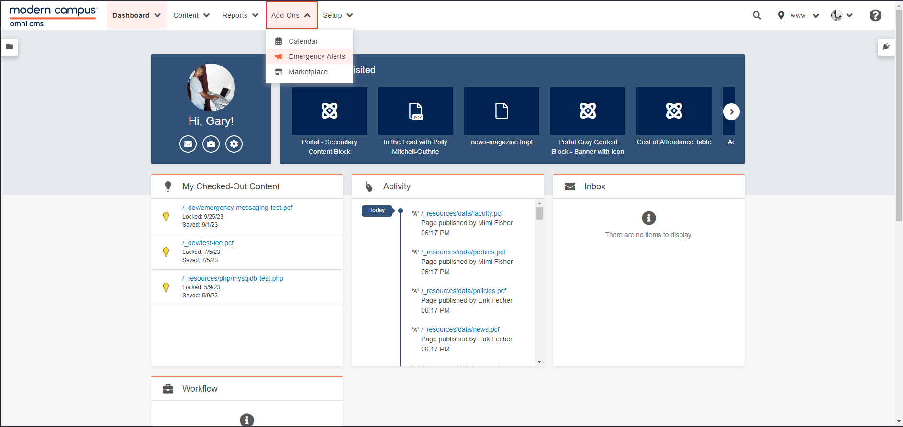
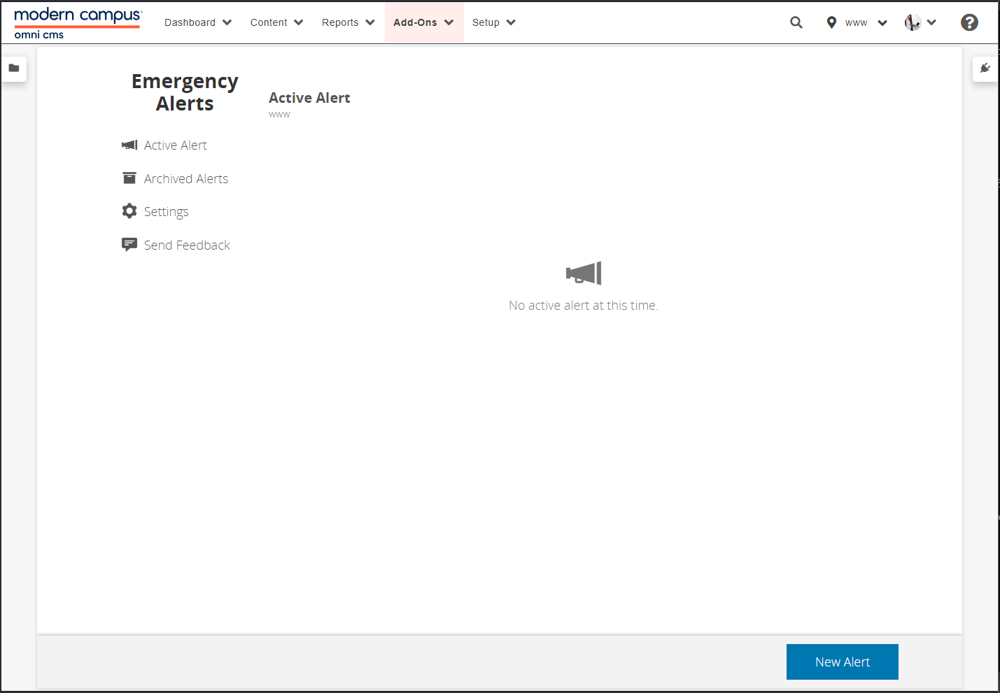
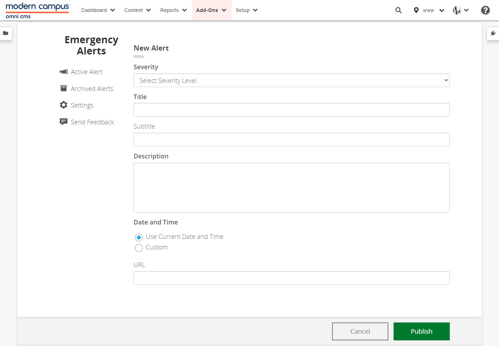
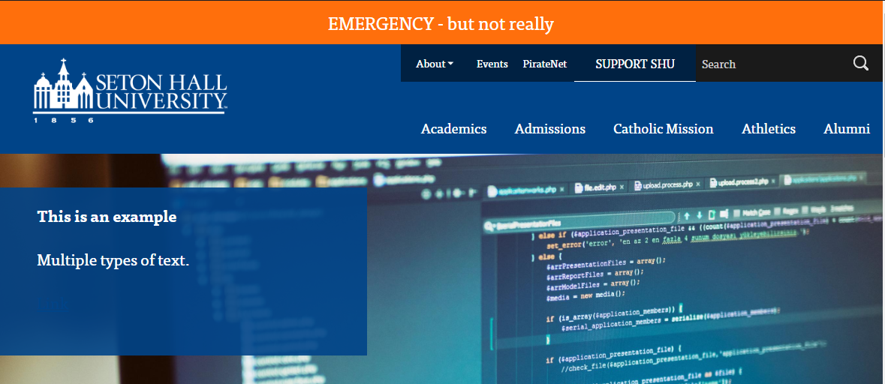
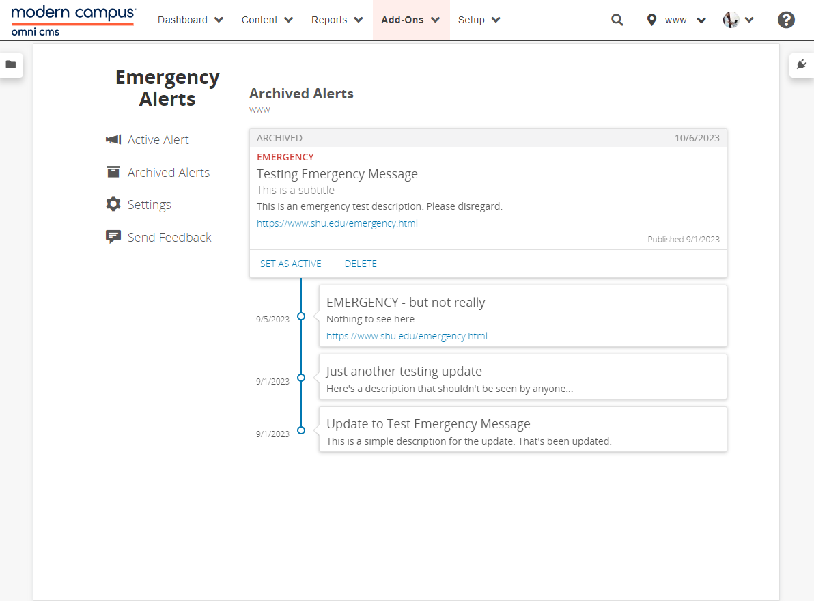
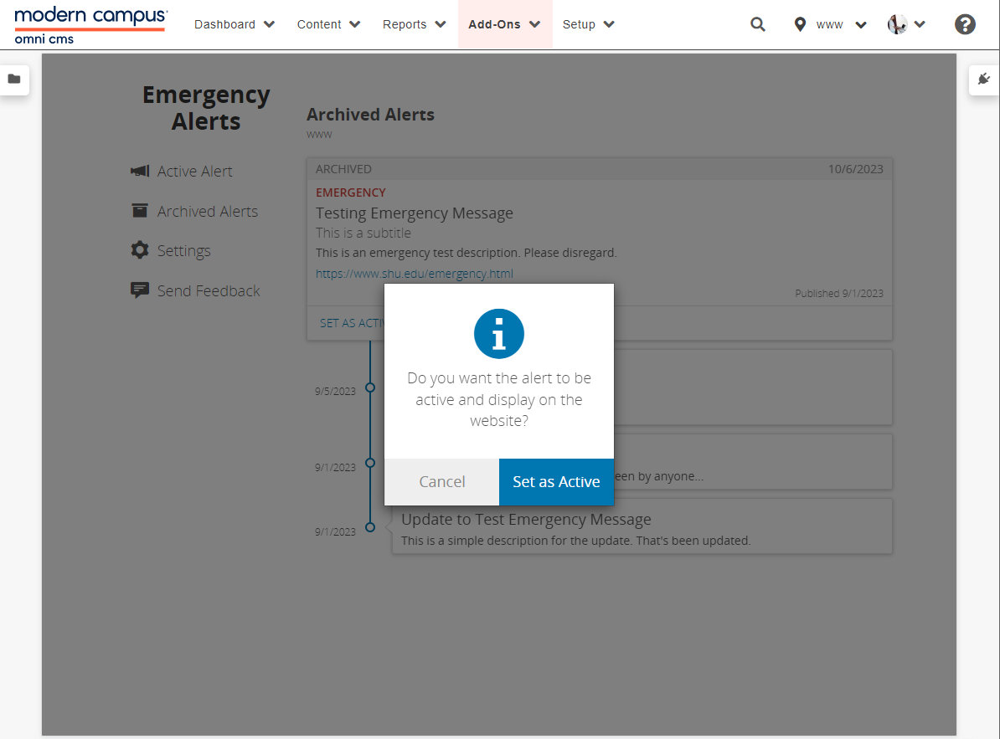

# Issuing an Emergency Alert in Omni CMS

{: .no_toc }

  

    Table of contents
  

  {: .text-delta }
- TOC
{:toc}

## Purpose

The purpose of this document is to help contributors with access activate an emergency alert on the home page of the Seton Hall Gateway site.
## Audience

The intended audience for this document is high level content contributors and admins for the university's website.

> [!note]
> For those who would like the official documentation from Modern Campus, please visit their support document on [the Emergency Alert module](https://support.moderncampus.com/learn-omni-cms/modules/emergency-alerts.html).

> [!info] 
> For detailed information about the settings for Emergency Alerts, please refer to our [Emergency Alerts Administrator's Guide](https://studentshu.sharepoint.com/:w:/t/moderncampus/Ed30M0K0Sv9IrP9R29IZTSYBtx0alzPt7bwHCH2FjY1gUA?e=hllpBp).

## Procedures

After logging into Omni CMS, navigate to the Add-On's menu and select `Emergency Alerts` 

Once the add-on has loaded, you will be presented with either the currently active message or the ability to create a new alert.

From this screen you have the ability to review the active alert, settings and archived alerts. You can edit the existing alert, add a new update, or edit an existing update. 

> [!warning]
> Please note, you can only have one (1) active alert at a time. You can issue as many updates as needed to the active alert.

### Create a New Alert

Selecting the `New Alert` button at the bottom of the screen provides the ability to create a new alert. Once opened, you can add the severity of the alert, add a title, subtitle, description, time and a URL for the alert to link to. All of the fields except for the `subtitle` and `URL` are **required**. However, you will need to put a URL in based on our standard operating procedures.

> [!info]
> Please note that our current UI/X for emergency messages **does not** display the date, subtitle or description.

There are current three (3) severity levels:

- Announcement
- Emergency
- Warning

Once you are satisfied with the alert, publish it with the green publish button at the bottom of the page. Once published, the alert will be active on designated pages.

### Activate an Archived Alert

If there is a need to reuse a previously published alert, it can be reactivated by selecting the `Archived Alerts` link on the left side of the `Emergency Alerts` dashboard.

Selecting an archived alert allows you to either set it as active or delete it. 

Once you select the alert to make active, select `SET AS ACTIVE` to continue. You will be prompted to confirm activating the archived alert.

Now that the archived alert has been activated it, along with all of the updates, can be edited. All previous updates will also be editable from the `Active Alert` page.

> [!tip] 
> In to order update an “Archived” Alert, the alert must **first** be made active on the site. Once activated, the you are able to make the necessary updates to the content.
> 
> > [!info]-
> > If needed, the settings can be modified so that the alert is not on a live page. Refer to the Admin Guide for instructions on how to change the page alerts are displayed on.

> [!warning]
> Since unarchiving an alert may require a content edit, it's worth noting that creating a new alert may be simpler. Creating a new alert could also provide time to craft the message as you like without concern for someone seeing an old message.

## References

- **Modern Campus Support - Emergency Alert Module** 
  =>  https://support.moderncampus.com/learn-omni-cms/modules/emergency-alerts.html
- **Modern Campus Support - Archived Alerts**
  => https://support.moderncampus.com/learn-omni-cms/modules/emergency-alerts.html#archivedalerts

--- 

> [!info] Metadata
> Author(s): K. Whary, G. L. Clark, II
> Created: 2023-08-29 10:33
> Last Modified: 2023-10-09 13:30
> Revision: 1.0
> Path: Gateway/Omni CMS Emergency Alert User Guide.md
> Tags: `= this.file.tags`
