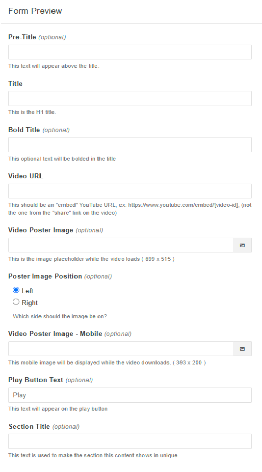
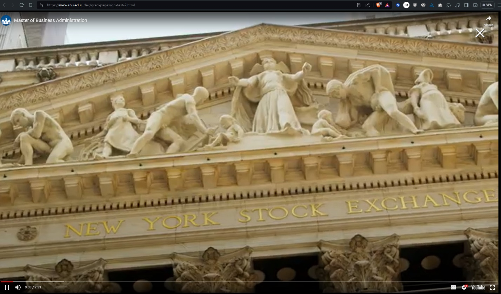

---
cssclasses:
  - cards
  - cards-cols-3
date-created: 2024-07-09 10:50:57
date-modified: 2024-07-09 10:50:57
description: This document details the different image sizes that are available for the Graduate Programs.
tags:
  - SetonHallUniversity
  - SetonHallUniversity/ModernCampus
  - SetonHallUniversity/LawSchool
  - SetonHallUniversity/Programs
  - SetonHallUniversity/ModerdCampus/Component
  - SetonHallUniversity/ModernCampus/Template
type:
  - generic note
title: Graduate Program Image Sizes
parent: 
grandparent: 
category: Modern Campus
layout: default
nav_enabled: true
has_children:
---
# [[Graduate Program Template]]

{: .no_toc }

  

    Table of contents
  

  {: .text-delta }
- TOC
{:toc}

This document details the different aspects of the Graduate Programs template that is being used in Modern Campus CMS.

## Video Hero Banner

We have developed a component that should be used in this section. It has the ability to create the "hero" content for the page, and can display the text as designed by JK Design to identify the program title and link to play an associated video (via a modal pop-up) by default to the left and to the right, a static image associated with the program, typically a freeze-frame from the video.

This content is intended to be used within the “Hero Content” section of Graduate Programs. Select the component and begin entering the data in the form to configure the page hero.

### Component Field Definitions

**Pre-Title:** 
This is the italicized text that appears above the program name, for these pages it would usually be "Graduate Programs", however if this is expanded to Undergraduate, we could use that text here instead.

**Title:** 
This is the first line, typically the degree level, ex: "Masters of Arts" or "Masters of Science..."

**Bold Title:** 
This is the program name itself. "Business Administration", "Sports Management"

> [!note] Character Limit
> At this time, there are no limits to the number of characters you can have in these fields. However, keep in mind how the content will be displayed.

**Video URL:** 
This is the URL of the YouTube video associated with this program. Like other places where we have used a YouTube video, this is an "embed" link. The URL would look similar to this: [***https://www.youtube.com/embed/RxyRUKpnPDY***](https://www.youtube.com/embed/RxyRUKpnPDY)

**Video Poster Image:** 
This is the still-frame "poster" image for the video, this would display in the right hand column (by default) in the hero section, which goes along with the next field

> [!warning] Image Sizes
> The image size associated with the hero banner is 699 pixels wide by 515 pixels high.

**Poster Image Position:** 
This determines whether the program title box appears to the left and the video poster image to the right, or if these should be flipped.

**Video Poster Image (Mobile):** 
A mobile-optimized version of the video poster image that is swapped in dynamically for mobile devices.

> [!warning] Image Sizes
> The image size associated with the hero banner is 393 pixels wide by 200 pixels high.

**Play Button Text:**
This is the text that will be displayed under the titles, directing visitors to watch the video.

**Section Title:** 
This is the title of the section as it would appear in the local navigation menu in the header, usually the default "Program Overview".

> [!note] Character Limit
> At this time, there are no limits to the number of characters you can have in these fields. However, keep in mind how the content will be displayed and that it will be part of the navigation.

The associated video will play in a modal window when the "Play Video" button is clicked. The "X" button in the top right corner closes the window and returns to the page.

## Quote

## Admission Requirements

## International Students

## Curriculum Overview

## Facilities

## Video

## Career Opportunities

## Video Testimonial

## Image Testimonial

## Our Faculty and Students

## Scholarships and Financial Aid

## FAQs

## About SHU

## Call to Action Links

## Image Gallery - Slider/Carousal

## Image Gallery - Scrolling Ticker

...

--- 

<small>
Last modified: Friday 16th February 2024 11:05:42
</small>
