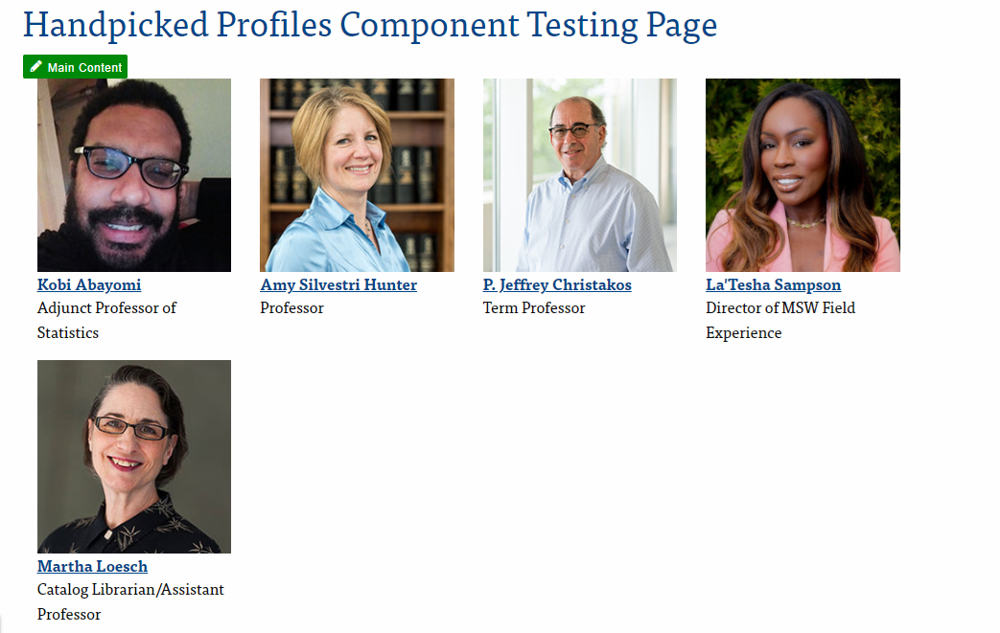
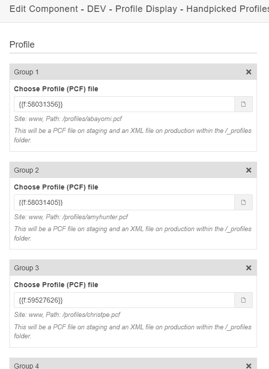
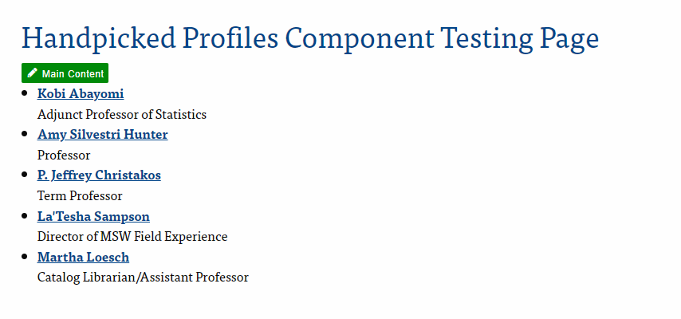

---
cssclasses:
  - cards
  - cards-cols-3
date-created: 2024-07-31 10:28:13
date-modified: 2024-08-05 10:35:13
description: This document outlines how to use the Modern Campus CMS Component, "Profiles - Manually Selected".
tags:
  - Procedure
  - SetonHallUniversity/ModernCampus
  - 
type:
  - generic note
title: Manually Selecting Profiles - Procedure
parent: 
grandparent: 
category: Modern Campus
layout: default
nav_enabled: true
has_children:
auhtor: Erik Fecher
---
# Manually Selected Profiles in Modern Campus CMS

{: .no_toc }

  

    Table of contents
  

  {: .text-delta }
- TOC
{:toc}

The ***Profiles - Manually Selected*** component can take a list of selected profiles and render them as either a block grid or a text-based unordered list. The block view, seen below, is typically used for Full-Time faculty on listing pages. While the list view is typically the style used for adjuncts.

## Using the Component

To use the component, add it to an editable region and enter the information on the input form. 

### Profile Group

Each profile to be displayed is represented by an input group in the form. Within each group, there is a file chooser to select the desired profile. All fields should be considered as required.

Similar to the *Single News Story* component and the *Quote component*, choose the profile that you would like to display. Once selected, you will be prompted to select which version of the file you want to use. Please select the `.XML` version of the published profile. 

### Adding More Groups

To add another profile to the listing, click the blue “ADD NEW GROUP” button at the bottom. 

### Display Style

After making your selections, choose which style you would like to show the profiles in. As mentioned earlier, there are two (2) ways to display them. 

> [!note]
> The "Block Grid" view should be selected by default. However, you may need to choose the radio button manually.

An example of the block grid has already been shown. Below is an example of the list view.

### Reordering Profiles

With a recent update from Modern Campus, the ability to re-order the profiles is now possible. If there is a need to be display the profiles in a different order than originally selected, simply use the arrow buttons at the top of each input group in the gray bar until the order of the profiles is how you need it.

## Requesting Help

If at any point you require assistance or something isn't working as expected, please reach out to the Web Development team. 
