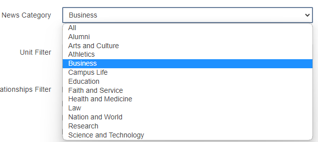
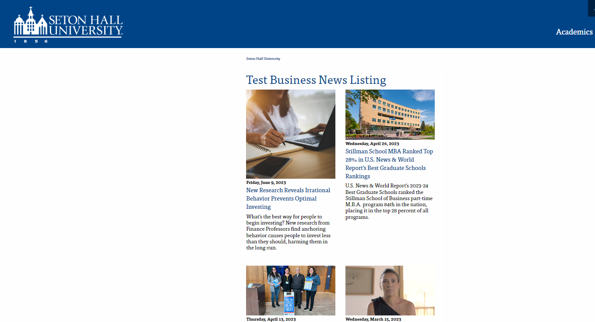

---
cssclasses:
  - cards
  - cards-cols-3
date-created: 2024-05-29 09:22:17
date-modified: 2024-05-29 09:22:17
description: This is a generic page that can be used to create other pages
tags:
  - Procedure
  - SetonHallUniversity/ModernCampus
  - ListPages
type:
  - generic note
title: News Listings - Procedure
parent: 
grandparent: 
category: Modern Campus
layout: default
nav_enabled: true
has_children:
---
# News Listing Pages

{: .no_toc }

  

    Table of contents
  

  {: .text-delta }
- TOC
{:toc}

From testing, it appears the procedure for setting up a News Listing page is as follows:

## Create a new page off the “News Listing Page” template.

With the page checked out, in Properties, give the page the usual properties: Title, Description, file name, etc.

Under News Options,

  - Enter the number of posts per page you would like to have the page display.
  -  Select the Filter Strength - "At Least One" or "All Options", this appears to be for the combination of filters below. Have a match be indicated by at least one of the filters applied or all to be considered a result for showing up on the page
  - Set the News Category. This is one of our 12 Categories: Alumni, Arts and Culture, Athletics, Business, Campus Life, Education, Faith and Service, Health and Medicine, Law, Nation and World, Research, Science and Technology, or all of the above. (this seems to be enough to get "Business" news to show up on a "Business News Index" page.    
  - Unit Filter - filter by a Unit
  - Relationships filter - any one of the check boxes that represent a relationship
  - Short Names - this appears to perhaps be from however SHU short names are associated with a news story.

This appears to be the minimum to create our basic News Listing pages. Creating a news index page for any of the Categories appears to only need the News Category set, “At Least One” for filter strength, and the number of items to show for the page listing.

Example (For Business):

Example Business Listing Page, 16 items, At Least One filter, News Category = Business, no Unit Filter, Relationship Filter or short name specified

--- 

<small>
Last modified: Friday 16th February 2024 11:05:42
</small>
